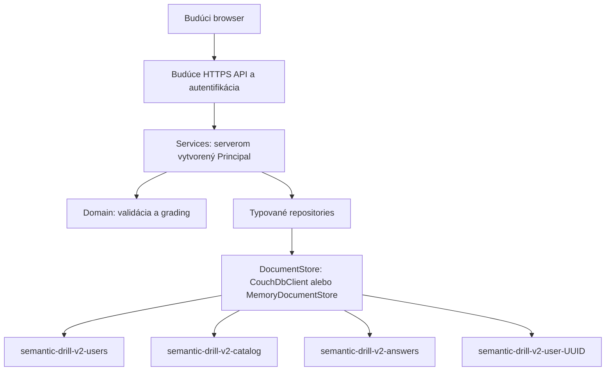

# Semantic Drill: multi-user backend v2

Vetva `server-collegues` vychádza zo `server-release`. V2 je samostatná serverová
knižnica bez HTTP listenera, prihlasovania alebo zmien React aplikácie. V1 v
`src/services/storage.ts` a `src/services/learningDatabase.ts` zostáva fallback.
Žiadny modul `server/` neimportuje v1 storage, neotvára `semantic-drill-learning`,
nečíta `VITE_COUCHDB_URL` a nespúšťa migráciu ani replikáciu.

## Vrstvy a databázy



| DB | Dokumenty | Účel |
| --- | --- | --- |
| `semantic-drill-v2-users` | `user:<uuid>`, `login:<normalized-login>` | Identity registry, role, status, auth seam, opt-in preference |
| `semantic-drill-v2-catalog` | `quiz:<quizId>:v<version>` | Výhradne publikovaný obsah bez odpovedí |
| `semantic-drill-v2-answers` | `answer-key:<quizId>:v<version>` | Immutable answer keys a explanations, iba backend |
| `semantic-drill-v2-user-<uuid>` | `attempt:<uuid>` | Rozpracované aj ukončené attempts/progress |
| rovnaká per-user DB | `user-quiz:<quizId>:v<version>` | Budúci private obsah |
| rovnaká per-user DB | `user-answer-key:<quizId>:v<version>` | Oddelené private answer keys |

Dokument má obálku `{ schemaVersion: 2, type, value }`. `type` je `user`, `quiz`,
`login-claim`, `answer-key`, `attempt`, `user-quiz` alebo `user-answer-key`. Answer-key dokumenty
majú navyše `contentHash` (SHA-256 kanonického verejného obsahu bez časových polí).
CouchDB pridáva `_id`, `_rev`; repozitáre vracajú token oddelene ako
`Versioned<T> = { value: T, revision: string }`. Verejné DTO revízie neobsahujú.

Login je normalizovaný cez trim/lowercase. Registry rezervuje UUID atómovým
vytvorením `user:<uuid>` a následne login dokumentom
`login:<login>` s hodnotou `{ login, userId }` a typom `login-claim`.
Identity sa sprístupnia až keď si oba dokumenty zodpovedajú. Tak ani súbežné
vytváranie nemôže priradiť dvom účtom rovnaké UUID alebo login. `UserRecord.id`
generuje serverové `randomUUID()`. Vyhľadávanie používa priame document GET,
nie scan registry. Login a UUID sú po vytvorení nemenné.
Názov per-user DB **vždy** používa UUID, nikdy login. `userDatabaseName()` prijíma
iba kanonické lowercase UUID s platným variantom/verziou; traversal, mená DB,
usernames aj aliasy s uppercase odmieta.

## Presný doménový model

Autoritatívne TypeScript definície sú v `server/domain/`.

```ts
type UserRole = 'admin' | 'student'
type UserStatus = 'active' | 'disabled'
interface Principal { userId: string; role: UserRole }
interface UserRecord {
  id: string
  login: string
  displayName: string
  role: UserRole
  status: UserStatus
  auth: { type: 'unconfigured' } | { type: 'password'; passwordHash: string }
  leaderboard: { optIn: boolean; displayName?: string }
  createdAt: number
  updatedAt: number
}
type PublicUser = Omit<UserRecord, 'auth'>

interface PublicQuizQuestion {
  id: number
  question: string
  options: string[]
  category?: string
  difficulty?: string
}
interface QuizDefinition {
  id: string
  version: number
  name: string
  description?: string
  source: { type: 'admin' } | { type: 'user'; ownerUserId: string }
  questions: PublicQuizQuestion[]
  createdAt: number
  publishedAt?: number
}
interface QuizAnswer {
  questionId: number
  correctAnswers: string[]
  explanation?: string
}
interface QuizAnswerKey {
  quizId: string
  version: number
  answers: QuizAnswer[]
}
type UserQuizStatus = 'draft' | 'private' | 'pending-review'
interface UserQuiz extends QuizDefinition {
  source: { type: 'user'; ownerUserId: string }
  status: UserQuizStatus
}

interface AttemptSettings {
  shuffleQuestions: boolean
  shuffleOptions: boolean
  timerMinutes: number
  categories: string[]
  passPercentage: number
}
interface Grade {
  correct: number
  incorrect: number
  unanswered: number
  total: number
  percentage: number
  passed: boolean
}
interface Attempt {
  id: string
  userId: string
  quizRef: { scope: 'catalog' | 'user'; quizId: string; version: number }
  status: 'active' | 'completed' | 'abandoned'
  startedAt: number
  updatedAt: number
  completedAt?: number
  currentIndex: number
  answers: Record<number, string[]>
  drafts: Record<number, string[]>
  revealed: number[]
  settings: AttemptSettings
  presentation: { questionOrder: number[]; optionOrder: Record<number, string[]> }
  result?: Grade & { timeTakenSeconds: number }
}
```

Časy sú epoch milisekundy; trvanie je celé číslo sekúnd. Otázky majú unikátne
nezáporné celočíselné ID, unikátne options a kompletný validný answer key. Verzie
sú kladné celé čísla. Nové účty majú `auth.type = 'unconfigured'`,
`leaderboard.optIn = false`, štandardne rolu `student` a status `active`.
Service nevracia auth metadata. Password varianta je pripravená len v storage
kontrakte; hashing, password setter a prihlasovanie neexistujú.

## Bezpečnostné hranice

- Budúca autentifikačná vrstva musí vytvárať `Principal` zo serverovej session.
  JSON z requestu nikdy nesmie byť zdrojom principalu. UUID samo nie je autentifikácia.
- Každá user-sensitive service kontroluje registry, `active` stav a súlad roly.
  `createUser`, `disableUser` a `publishQuiz` navyše vyžadujú registry-backed admina.
  Prvý admin sa seeduje dôveryhodným serverovým bootstrapom cez repository; nie je
  vytvorený defaultný účet, heslo ani bootstrap HTTP endpoint.
- Attempt a private-quiz repositories vyberajú DB výlučne z principalu a znovu
  kontrolujú vlastníka dokumentu. Ani admin nemá implicitný cross-user prístup.
  `disableUser` je explicitná admin operácia s cieľovým UUID, nie voľba dátovej DB.
- `createBackend().repositories` a `DocumentStore` sú interné serverové objekty.
  Budúce API má volať services; nesmie sprístupniť raw repository/DB metódy.
- DTO používajú explicitný zoznam polí aj za behu. Prípadné extra
  `correctAnswers`, `explanation` alebo `answerKey` z importovaného objektu
  neprejdú do verejnej otázky ani uloženého katalógu. Grading číta oddelený key.
- Attempt input povoľuje iba referenciu a settings; update iba `answers`,
  `drafts`, `currentIndex`. Klientské `userId`, DB, score, status, časy, settings
  po štarte, presentation a `revealed` update sa odmietajú.
- CouchDB je interný datastore, bez browser credentials a replikácie. Transport
  používa Node `fetch`, Basic auth header, timeout a zakazuje redirecty. Chyby
  nevracajú telo CouchDB odpovede ani prihlasovacie údaje.
- Explicitný provisioning nastaví `_security` členstvo iba pre backend account a
  CouchDB server adminov. Aplikačné roly nie sú CouchDB účty. Inicializácia vyžaduje
  účet oprávnený vytvárať DB a nastavovať security. Pri chybe sa provisioning
  nepovažuje za úspešný; user record sa uloží až po zabezpečení per-user DB.

CouchDB revízie a HTTP 409 sú základom compare-and-swap; nejde o transakciu medzi
DB. Pozri [CouchDB document API](https://docs.couchdb.org/en/stable/api/document/common.html)
a [database security](https://docs.couchdb.org/en/stable/api/database/security.html).

## Publikovanie a lifecycle

`QuizService.publishQuiz(principal, input)` naraz validuje celý pár, vytvorí
immutable answer key a potom immutable publikovaný obsah. Každá zmena vyžaduje
novú explicitnú verziu; už publikovaná verzia sa neupsertuje. Ak druhý zápis
zlyhá, zostane len neprístupný key. Retry rovnakého obsahu a key smie dokončiť
publikovanie, ale iný obsah alebo key pod tým istým ID/verziou dostane `CONFLICT`.
Pri zlyhanom vytvorení účtu môže zostať prázdna per-user DB a pending UUID
record bez login claimu. Taký záznam sa cez identity repository ani services
nesprístupní. Interný retry s rovnakým `UserRecord` môže claim dokončiť; nový
UUID môže nezarezervovaný login získať bez sprístupnenia starého pending záznamu.
Nič sa automaticky nemaže. Tieto situácie neovplyvňujú v1.

Attempt prechádza `active -> completed` alebo `active -> abandoned`.
`startAttempt` uloží serverové UUID, ownera, settings a konkrétne poradie otázok
a options po filtrovaní/shuffle. Presentation je povinná, aby resume neregeneroval
poradie. Predvolené settings: bez shuffle, timer `0`, všetky kategórie, pass `70`.

`updateAttempt` aplikuje patch mapy odpovedí/draftov a navigácie. Neuvedené otázky
zostávajú zachované; `[]` je odoslaná nesprávna odpoveď, chýbajúca položka je
nezodpovedaná, rovnako ako vo v1. Neznáme otázky/options a duplicity sa odmietajú.
`revealed` je pripravené prázdne pole; reveal service v tejto iterácii nie je.

`finishAttempt` neprijíma skóre ani nové odpovede. Načíta uložené odpovede,
pôvodnú verziu obsahu a key, vyhodnotí presnú zhodu množiny options, uloží výsledok
a serverový čas. Drafty sa nehodnotia a pri dokončení vyprázdnia. Percentá sa
zaokrúhľujú cez `Math.round`, pass/fail používa uloženú hranicu. Timer je uložené
nastavenie; plánovač automatického finish/deadline enforcement tu ešte nie je.

Zápis vyžaduje pôvodnú revíziu. Ak súbežný update vyhrá, finish znovu načíta
a vyhodnotí aktuálne dáta (najviac päť pokusov, potom retryable `CONFLICT`). Ak
vyhrá iný finish, vráti sa už uložený výsledok. Ukončený/abandoned attempt je
nemenný aj cez repository. `finish` completed attemptu vráti pôvodný dokument bez
nového zápisu. `abandon` je tiež opakovateľný; abandoned attempt nemožno dokončiť.

Private quizzes používajú rovnaké oddelenie obsahu a key, ale oba dokumenty sú
v DB vlastníka, nikdy v spoločnom katalógu. Aj ich verzie sú zatiaľ immutable.
`userQuizzesEnabled = false` je explicitný serverový default. Všetky user-quiz
service operácie aj štart attemptu v scope `user` odmietajú disabled feature.
Repository je testovateľné nezávisle od gate. Ani ručné zapnutie gate nesprístupní
publikovanie: táto operácia vráti `NOT_IMPLEMENTED`.

## Použitie a overovanie

Node 22+, ESM TypeScript. Kompozícia je explicitná a bez startup I/O:

```ts
import { createBackend } from './server/createBackend.js'
import { CouchDbClient } from './server/storage/couchdb/CouchDbClient.js'

// Hodnoty iba zo serverového secret/config systému, nikdy VITE_* premenné.
const backend = createBackend(new CouchDbClient({ url, username, password }))
await backend.initialize() // explicitne vytvorí/zabezpečí iba tri v2 shared DB
// Dôveryhodný bootstrap raz vloží UserRecord s randomUUID() a rolou admin.
// Následné createUser automaticky provisionuje zabezpečenú per-user DB.
```

Pre testy sa namiesto klienta používa `new MemoryDocumentStore()`. Rovnaké
`Stored*Repository` implementácie sú použité pre oba adaptéry: business pravidlá
sa neduplikujú do samostatných Couch/Memory repository tried.

```bash
npm run test:server
npm run typecheck:server
npm test
npm run lint
npm run build
```

Serverový Vitest config nemá React/PouchDB setup. `npm test` naďalej spúšťa aj
pôvodné frontend testy. Kontraktové testy bežia proti memory store aj deterministickej
CouchDB HTTP simulácii: izolácia používateľov, DTO leakage, role/status, grading,
versioning, concurrent finish/update, immutable výsledky, login uniqueness,
private storage/gate, publication failure/retry a DB security provisioning.
HTTP simulácia nenahrádza integračný test proti živému CouchDB; ten treba vykonať
na izolovanej testovacej inštancii pred produkčným nasadením.

## Zámerne mimo tejto iterácie

Žiadny nový WebUI, HTTP API, login/registrácia/OAuth/password reset, upload endpoint,
publikovanie user quizzes, leaderboard API/DB/ranking, Funnel ani cmz-apphost
deployment. Existujúci frontend naďalej používa v1. Ďalšia iterácia môže pridať
autentifikáciu a HTTPS API nad services, integračné overenie na CouchDB a neskôr
frontend. Leaderboard má pripravené `userId`, `quizRef.quizId/version`,
`completedAt`, `result.percentage`, `result.timeTakenSeconds` a explicitný opt-in;
porovnateľnosť nastavení a pravidlá hodnotenia bude musieť definovať jeho vlastná
serverová politika. Žiadne v1 dáta sa nekonvertujú ani nemenia.
